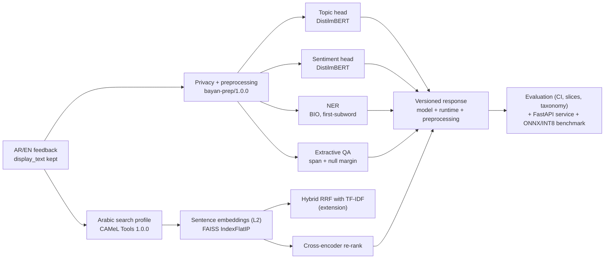

# بيان — Bilingual Applied NLP Project | مشروع بيان لمعالجة اللغة ثنائي اللغة

- **Learner ID / GitHub username:** `Manal-qaysi` — منال قيسي (Manal Qaysi)
- **GitHub:** https://github.com/Manal-qaysi/bayan-nlp-Manal-qaysi
- **Final release:** [`submission-v1.0`](https://github.com/Manal-qaysi/bayan-nlp-Manal-qaysi/releases/tag/submission-v1.0)

> هذا الملف يُولَّد من `docs_src/README.md.j2` عبر `python scripts/collect_results.py`. كل رقم فيه منقول آليًا من مخرجات دفاتري المنفّذة، وله رابط إلى مصدره. أي قيمة معلّمة بـ ⏳ تعني أن الدفتر المسؤول عنها لم يُشغَّل ويُحفظ بعد.

## Executive summary | الملخص

**المشكلة:** تصل إلى جهة خدمية ملاحظات قصيرة بالعربية (فصحى ولهجة خليجية) وبالإنجليزية عن الخدمات الرقمية والتصاريح والصحة والنقل. يحتاج الموظف إلى أربعة أشياء: معرفة **موضوع** الملاحظة و**مشاعرها**، واستخراج **الكيانات** منها (الخدمة، المكان، التاريخ، رقم المرجع، الجهة)، و**الإجابة** عن سؤال من نص إجراء أو الامتناع إن لم تكن الإجابة فيه، و**البحث** عن حالة سابقة مشابهة ولو كُتبت باللغة الأخرى.

**المستخدم:** موظف فرز ومتابعة يراجع كل مخرجات النظام، ولا يتخذ النظام قرارًا عن أي شخص.

**النتيجة:** خط معالجة كامل يبدأ بحماية النص (حفظ النسخة الأصلية وحجب البريد والجوال)، ثم التصنيف (رأسا topic وsentiment مع baseline)، وNER، وQA استخراجي مع حالة عدم الإجابة، وبحث دلالي ثنائي اللغة بـFAISS، ثم تقييم مع فترات ثقة وتحليل أخطاء، وأخيرًا خدمة FastAPI مختبرة وقياس ONNX/INT8.

**الحدود:** **البيانات تعليمية اصطناعية** من مادة الدورة، وليست بيانات مستفيدين حقيقيين. مجموعات التقييم صغيرة جدًا (8 أمثلة test للتصنيف)، لذلك كل النتائج `MEASURED_SMOKE`، ولا تمثل أداءً إنتاجيًا.

## What Bayan does | ماذا يفعل بيان؟

1. **الخصوصية والمعالجة:** عقد نسختين: `display_text` تبقى كما وصلت، و`model_text` تمر بعقد معالجة موحّد ذي إصدار `bayan-prep/1.0.0` (NFC، إزالة التطويل، حجب البريد والجوال السعودي، توحيد المسافات). يُطبَّق العقد نفسه في التدريب (03) والخدمة (08). وفي البحث يُطبَّق profile عربي بـCAMeL Tools (`search` 1.0.0) مع اختبارات ذهبية.
2. **تصنيف الموضوع والمشاعر:** رأسان مستقلان على DistilmBERT متعدد اللغات، ولكل رأس baseline من TF-IDF + LinearSVC على التقسيم المجمّد نفسه.
3. **NER:** محاذاة BIO على مستوى أول subword، وتقييم صارم على مستوى الكيان، لكل نوع كيان.
4. **QA استخراجي:** اختيار مقطع مقيَّد من السياق، مع هامش null لعدم الإجابة، ومقاييس EM/F1 ودقة عدم الإجابة، واختبارات حدّية.
5. **بحث دلالي ثنائي اللغة:** متجهات جمل مطبّعة L2، وفهرس FAISS `IndexFlatIP`، وإعادة ترتيب بـcross-encoder مقاسة، ومقاييس Recall@3/MRR@3، وعتبة no-answer مجمّدة من validation. **الامتداد:** دمج sparse+dense بـRRF.
6. **التقييم والخدمة:** bootstrap CI، ومقارنة زوجية، وشرائح اللغة، وتصنيف للأخطاء، وقياس PyTorch مقابل ONNX FP32 وINT8 مع التكافؤ وأثر الجودة، وخدمة FastAPI مختبرة بالعربية والإنجليزية والمدخلات المرفوضة.

## Scope and non-goals | النطاق وما لا يدّعيه المشروع

- **In scope | ضمن النطاق:** نصوص قصيرة عربية (فصحى وخليجية) وإنجليزية، في أربعة موضوعات خدمية: `digital_service` و`health` و`permit` و`transport`. وخمسة أنواع كيانات: `SERVICE` و`LOCATION` و`DATE` و`REF_NUM` و`ORG`. وقاعدة حالات صغيرة للبحث.
- **Out of scope | خارج النطاق:** Arabizi (يُمرَّر في مسار مستقل ولا يُصنَّف)، والنصوص الطويلة، واللهجات غير الخليجية، والتوليد الحر للإجابات.
- **Not for | ليس صالحًا لـ:** اتخاذ قرارات حكومية أو إنتاجية عن أشخاص حقيقيين، أو التنميط (profiling)، أو أي قرار عالي المخاطر، قبل تحقق أوسع ومراجعة بشرية.

## Reproduce on Google Colab Free | إعادة التشغيل

| # | Notebook | Colab | Purpose | Result saved |
|---:|---|---|---|---|
| 00 | [`00_runtime_doctor.ipynb`](notebooks/00_runtime_doctor.ipynb) | [Open in Colab](https://colab.research.google.com/github/Manal-qaysi/bayan-nlp-Manal-qaysi/blob/main/notebooks/00_runtime_doctor.ipynb) | runtime doctor (environment) | ⏳ PENDING_RUN |
| 01 | [`01_text_processing_tokenization.ipynb`](notebooks/01_text_processing_tokenization.ipynb) | [Open in Colab](https://colab.research.google.com/github/Manal-qaysi/bayan-nlp-Manal-qaysi/blob/main/notebooks/01_text_processing_tokenization.ipynb) | text processing / tokenisation (Gate A · T1) | ⏳ PENDING_RUN |
| 02 | [`02_attention_transformers.ipynb`](notebooks/02_attention_transformers.ipynb) | [Open in Colab](https://colab.research.google.com/github/Manal-qaysi/bayan-nlp-Manal-qaysi/blob/main/notebooks/02_attention_transformers.ipynb) | attention / transformers (T2) | ⏳ PENDING_RUN |
| 03 | [`03_text_classification.ipynb`](notebooks/03_text_classification.ipynb) | [Open in Colab](https://colab.research.google.com/github/Manal-qaysi/bayan-nlp-Manal-qaysi/blob/main/notebooks/03_text_classification.ipynb) | topic + sentiment classification (Gate B · T3) | ✅ `nb03_classification` |
| 04 | [`04_ner_and_qa.ipynb`](notebooks/04_ner_and_qa.ipynb) | [Open in Colab](https://colab.research.google.com/github/Manal-qaysi/bayan-nlp-Manal-qaysi/blob/main/notebooks/04_ner_and_qa.ipynb) | NER and extractive QA (Gate B · T3) | ⏳ PENDING_RUN |
| 05 | [`05_arabic_nlp.ipynb`](notebooks/05_arabic_nlp.ipynb) | [Open in Colab](https://colab.research.google.com/github/Manal-qaysi/bayan-nlp-Manal-qaysi/blob/main/notebooks/05_arabic_nlp.ipynb) | Arabic NLP (CAMeL profile) (Gate C · T1) | ⏳ PENDING_RUN |
| 06 | [`06_semantic_search.ipynb`](notebooks/06_semantic_search.ipynb) | [Open in Colab](https://colab.research.google.com/github/Manal-qaysi/bayan-nlp-Manal-qaysi/blob/main/notebooks/06_semantic_search.ipynb) | semantic search + extension (Gate C · T4/T7) | ⏳ PENDING_RUN |
| 07 | [`07_evaluation_error_analysis.ipynb`](notebooks/07_evaluation_error_analysis.ipynb) | [Open in Colab](https://colab.research.google.com/github/Manal-qaysi/bayan-nlp-Manal-qaysi/blob/main/notebooks/07_evaluation_error_analysis.ipynb) | evaluation / error analysis (Gate C · T5) | ⏳ PENDING_RUN |
| 08 | [`08_optimization_serving.ipynb`](notebooks/08_optimization_serving.ipynb) | [Open in Colab](https://colab.research.google.com/github/Manal-qaysi/bayan-nlp-Manal-qaysi/blob/main/notebooks/08_optimization_serving.ipynb) | optimisation / serving (Gate D · T6) | ✅ `nb08_benchmark` |

**خطوات التشغيل النظيف (الترتيب مهم):**

1. افتحي كل دفتر من رابط Colab أعلاه بالترتيب **00 → 08**، واختاري **Runtime → Restart session and run all**. الدفاتر تستنسخ هذا المستودع تلقائيًا لقراءة `data/sample` و`src/bayan`.
2. بعد انتهاء كل دفتر: **File → Save a copy in GitHub**، والمسار `notebooks/<الاسم نفسه>` على `main`. **احفظي 03–06 قبل تشغيل 07**، لأن 07 يقرأ مخرجاتها المحفوظة.
3. الدفتر 03 يحفظ النموذج في Google Drive (`MyDrive/bayan/model-v1`)، والدفتر 08 يقرؤه من هناك. **لا تُرفع الأوزان إلى GitHub.**
4. في الدفتر 07 اقرئي الأخطاء المطبوعة، وصحّحي التصنيف في `MY_TAG_OVERRIDES` عند الحاجة، واجعلي `TAXONOMY_REVIEWED_BY_ME = True`، ثم أعيدي التشغيل والحفظ.
5. من جذر المستودع:

```bash
pip install -r requirements-dev.txt
python scripts/collect_results.py --strict      # extracts results, renders the docs, runs tests + privacy scan
PYTHONPATH=src python -m pytest -q tests
python scripts/validate_submission.py . --json-report reports/submission_validation.json
python scripts/preflight_submission.py . --report reports/preflight.json
```

لا تضعي tokens أو بيانات شخصية أو أوزان نماذج أو روابط Drive خاصة في المستودع.

## Architecture | المعمارية



### Attention | مسار المشفّر وحدود تفسير الانتباه

**مسار المشفّر (DistilmBERT، كما قيس في [دفتر 02](notebooks/02_attention_transformers.ipynb)):**

1. يقسّم المرمّز النص إلى subwords.
2. يُضاف إلى كل رمز embedding للموضع، لأن الانتباه وحده لا يعرف ترتيب الكلمات.
3. تمر المتجهات على ⏳ PENDING_RUN طبقات encoder. في كل طبقة: multi-head self-attention بـ⏳ PENDING_RUN رأسًا، ثم residual وLayerNorm، ثم شبكة feed-forward لكل موضع، ثم residual وLayerNorm مرة أخرى.
4. في كل رأس تُسقَط الحالة المخفية إلى Q وK وV بالشكل `⏳ PENDING_RUN` (batch, heads, T, d_head=⏳ PENDING_RUN). ثم softmax(QKᵀ/√d_k + mask)·V.
5. قناع الحشو يعطي مفاتيح `[PAD]` وزنًا صفريًا. أعلى وزن قسته على `[PAD]` في كل الطبقات والرؤوس = `⏳ PENDING_RUN`.
6. التصنيف يقرأ تمثيل `[CLS]`، وNER يقرأ تمثيل كل رمز، وQA يقرأ رأسين للبداية والنهاية على رموز السياق فقط.

**حدود التفسير:** خريطة الانتباه **وصف** لما حسبه رأس معيّن، وليست **تفسيرًا سببيًا** لقرار النموذج. أولًا، الأوزان تُمزج بعدها مع V، ثم تمر بـresiduals وFFN وطبقات أخرى. ثانيًا، الرؤوس متعددة ومتكررة. ثالثًا، الوزن العالي لا يعني أن حذف الرمز سيغيّر التنبؤ. لذلك لا أستخدم heatmap واحدة دليلًا، وأي ادعاء سببي يحتاج تجربة حذف أو استبدال مع قياس أثرها.

## Results | النتائج

كل رقم يحمل وسمه. `MEASURED_SMOKE` يعني قياسًا فعليًا على عينة الدورة الصغيرة، و`MEASURED` يعني قياس PROJECT_ARTIFACT لنموذجي في دفتر 08.

| Component | Metric | Result + label | Split / workload | Evidence |
|---|---|---:|---|---|
| topic classification | Macro-F1 (Transformer / baseline) | 0.867 / 0.733 · `MEASURED_SMOKE` | frozen test, n=8 | [nb03](reports/nb03_classification.json) · [CI](reports/nb07_evaluation.json) |
| sentiment classification | Macro-F1 over observed labels (Transformer / baseline) | 0.356 / 1.000 · `MEASURED_SMOKE` | frozen test, n=8 | [nb03](reports/nb03_classification.json) |
| NER | strict entity F1 | ⏳ PENDING_RUN · `MEASURED_SMOKE` | test, ⏳ PENDING_RUN gold entities | [nb04](reports/nb04_ner_qa.json) |
| QA | EM / F1 / no-answer acc. | ⏳ PENDING_RUN / ⏳ PENDING_RUN / ⏳ PENDING_RUN · `MEASURED_SMOKE` | test, n=⏳ PENDING_RUN | [nb04](reports/nb04_ner_qa.json) |
| search | Recall@3 / MRR@3 (dense) | ⏳ PENDING_RUN / ⏳ PENDING_RUN · `MEASURED_SMOKE` | test, ⏳ PENDING_RUN answerable queries | [nb06](reports/nb06_retrieval.json) |
| search no-answer | accuracy with frozen threshold | ⏳ PENDING_RUN · `MEASURED_SMOKE` | test | [nb06](reports/nb06_retrieval.json) |
| serving | p95 ms / items/s / quality tax (selected: `pytorch-fp32`) | PyTorch 366.9 ms · ONNX 277.4 ms · `MEASURED` | validation workload, n=8, CPU | [`BENCHMARKS.md`](BENCHMARKS.md) |

**الدقة الإحصائية:** Macro-F1 لرأس topic على test مع 95% bootstrap CI هو ⏳ PENDING_RUN، والفرق الزوجي Transformer − baseline هو ⏳ PENDING_RUN. هل يدعم الفرق ادعاءً اتجاهيًا؟ **⏳ PENDING_RUN**. التفاصيل في [`EVALUATION_REPORT.md`](EVALUATION_REPORT.md).

## Error found and decision | خطأ وقرار

- **Observed failure | الخطأ الملاحظ:** الفئة الأكثر تكرارًا بين أخطاء نماذجي هي `⏳ PENDING_RUN` (⏳ PENDING_RUN أخطاء، مثل ⏳ PENDING_RUN). مثال: «⏳ PENDING_RUN».
- **Slice / taxonomy:** المهام: ⏳ PENDING_RUN؛ الجدول الكامل في [`EVALUATION_REPORT.md`](EVALUATION_REPORT.md) §7.
- **Fix or deferred action | الإصلاح:** ⏳ PENDING_RUN. **مقياس القبول:** ⏳ PENDING_RUN.
- **Evidence after change | الدليل بعد التغيير:** لم يُنفَّذ الإصلاح في هذه النسخة (**deferred**) لأن تنفيذه يحتاج بيانات جديدة. اختبار عدم الرجوع المقترح: ⏳ PENDING_RUN.

## Measured extension | الامتداد المقاس

- **Extension chosen:** بحث هجين sparse (TF-IDF حرفي) + dense (FAISS) بدمج Reciprocal Rank Fusion (`k=60`).
- **Baseline:** البحث الكثيف وحده بـ`⏳ PENDING_RUN` + `IndexFlatIP`.
- **Benefit/cost metric:** MRR@3 على validation: dense ⏳ PENDING_RUN ← hybrid ⏳ PENDING_RUN (الفرق ⏳ PENDING_RUN). Recall@3 عبر اللغات لم ينخفض: ⏳ PENDING_RUN. الكلفة الزمنية الإضافية: ⏳ PENDING_RUN ms للاستعلام (الزمن الوسيط). على test: MRR@3 dense ⏳ PENDING_RUN مقابل hybrid ⏳ PENDING_RUN.
- **Evidence path:** [`reports/nb06_extension.json`](reports/nb06_extension.json)، ومصدره [دفتر 06](notebooks/06_semantic_search.ipynb) (قسم «🟣 الامتداد المقاس»).
- **Decision and limitation:** **⏳ PENDING_RUN** وفق قاعدة كُتبت قبل القياس (ربح ≥ 0.05 في MRR@3، وعدم تراجع Recall عبر اللغات، و≤ 5 ms إضافية). القيد: 10 استعلامات validation و8 test فقط.

## Repository evidence | حزمة الأدلة

- [`DATA_CARD.md`](DATA_CARD.md) · [`MODEL_CARD.md`](MODEL_CARD.md) · [`EVALUATION_REPORT.md`](EVALUATION_REPORT.md) · [`BENCHMARKS.md`](BENCHMARKS.md)
- [`DECISIONS.md`](DECISIONS.md) · [`PROGRESS.md`](PROGRESS.md) · [`PRESENTATION.md`](PRESENTATION.md) · [`STUDENT_PROFILE.md`](STUDENT_PROFILE.md)
- [`PROJECT_SUMMARY.json`](PROJECT_SUMMARY.json) · [`SUBMISSION.yml`](SUBMISSION.yml)
- [`reports/`](reports/): JSON لكل دفتر، و[`results_index.json`](reports/results_index.json) الذي يحدد الدفتر والخلية والـcommit لكل نتيجة.
- [`src/bayan/`](src/bayan/): مكتبة المشروع، ومنها [`project.py`](src/bayan/project.py). و[`tests/`](tests/): اختبارات الوحدات والاختبارات الذهبية العربية.

## Limitations and responsible use | الحدود والاستخدام المسؤول

- **Data limitation:** البيانات تعليمية اصطناعية وصغيرة جدًا: 24/8/8 للتصنيف، و12 جملة NER، و10 أسئلة QA، و24 حالة و18 استعلامًا للبحث. لا توجد بيانات مستفيدين حقيقيين.
- **Arabic/dialect/Arabizi:** الخليجية ممثلة بأمثلة قليلة، واللهجات الأخرى غائبة، وArabizi لا يُصنَّف بل يُعلَّم بقاعدة شفافة فقط.
- **Task/model limitation:** DistilmBERT مدرَّب على CPU بتحديث آخر طبقة فقط (أو تدريب كامل قصير على GPU). وفي sentiment تنقص validation فئة `positive` وتنقص test فئة `neutral`.
- **Evaluation uncertainty:** فترات الثقة واسعة جدًا مع n=8. لا أدّعي تفوق نموذج على آخر ما لم تستبعد الفترة الزوجية الصفر.
- **Serving/security limitation:** الخدمة تعمل داخل Colab عبر TestClient فقط، بلا مصادقة ولا rate limiting ولا نشر عام. وحجب PII يقتصر على البريد والجوال السعودي.
- **Human review requirement:** كل مخرج يراجعه موظف قبل أي إجراء. ولا يُستخدم النظام لاتخاذ قرار عن شخص.

## Final validation | الفحص النهائي

```bash
PYTHONPATH=src python scripts/validate_submission.py . --require-tag
PYTHONPATH=src python scripts/preflight_submission.py . --require-tag
```

- Validator status: `reports/submission_validation.json` و`reports/preflight.json` (يُولَّدان بالأمرين أعلاه قبل إنشاء الوسم).
- CI: [GitHub Actions — tests](https://github.com/Manal-qaysi/bayan-nlp-Manal-qaysi/actions).
- Release `submission-v1.0`: https://github.com/Manal-qaysi/bayan-nlp-Manal-qaysi/releases/tag/submission-v1.0

## Presentation | العرض

انظري [`PRESENTATION.md`](PRESENTATION.md): خمسة أقسام، وأمثلة عربية وإنجليزية من تشغيلي، وحالة عدم إجابة ومدخل مرفوض، وروابط التقارير.

## My contribution | مساهمتي

- **My change and file:** [`my_work/nlp3.py`](my_work/nlp3.py) هو سكربت Colab كتبته بنفسي لليوم الأول: فحص البيئة، ومعالجة النص مع حجب البريد والجوال، والترميز بـWordPiece، وfertility وtruncation، والانتباه المقيَّس بالأقنعة وmulti-head، وتدقيق المعاملات. منه أخذت عقد المعالجة المحافظ الذي صار `bayan-prep/1.0.0`. واخترت ميزانية الأداء (p95 ≤ 100 ms، ≥ 20 عنصر/ث، أثر جودة ≤ 0.02 على CPU) قبل القياس، كما في [`BENCHMARKS.md`](BENCHMARKS.md) §2.
- **Reason and evidence:** شغّلت الدفاتر التسعة على Colab وحفظت مخرجاتها في `notebooks/`، وراجعت تصنيف أخطاء نماذجي في [دفتر 07](notebooks/07_evaluation_error_analysis.ipynb)، واتخذت قرار الامتداد وفق القاعدة المكتوبة مسبقًا. الدليل في [`reports/results_index.json`](reports/results_index.json) (الدفتر والخلية والـcommit لكل رقم).

## AI assistance | الاستعانة بالأدوات

- **الأداة:** Claude من Anthropic، استخدمته في 30 سبتمبر 2026 بعد استلام تقييم المدربة.
- **نوع المساعدة:** إعادة تنظيم المستودع بالهيكل المطلوب. كتابة [`src/bayan/project.py`](src/bayan/project.py) و[`tests/test_project_helpers.py`](tests/test_project_helpers.py) و[`tests/test_my_arabic_golden.py`](tests/test_my_arabic_golden.py). إضافة خلايا «🟣 مشروعي» إلى الدفاتر: أدلة الترميز واختيار `MAX_LENGTH`، ورأس sentiment، وتقييم NER لكل نوع، وتقييم QA، والبحث الهجين، وتحليل أخطاء نماذجي، وتشغيل 08 على نموذجي. كتابة [`scripts/collect_results.py`](scripts/collect_results.py) وقوالب `docs_src/`. صياغة نصوص README وDECISIONS، ومنها شرح مسار المشفّر وحدود الانتباه.
- **كيف تحققت:** شغّلت كل الدفاتر بنفسي على Colab. كل رقم في التقارير منقول آليًا من مخرجات تشغيلي، ولم يُكتب أي رقم يدويًا أو بواسطة الأداة. قرأت الكود المضاف وأستطيع شرحه، وشغّلت `pytest` والفاحصَين.
- **المصادر:** مادة الدورة ودفاترها ووحدات `src/bayan` الأصلية من [bayan-applied-nlp-course](https://github.com/almiyead-rgb/bayan-applied-nlp-course) (ميعاد المري). والنماذج من Hugging Face كما في بطاقاتها، والمكتبات كما في `requirements-day*.txt`.

## Training context | السياق التدريبي

This educational project was developed during Applied Natural Language Processing
with Transformers (SDA-AIE-211) in the SDAIA Academy training context.
أُنجز هذا المشروع التعليمي ضمن دورة معالجة اللغات الطبيعية باستخدام المحولات
(SDA-AIE-211) في السياق التدريبي لأكاديمية سدايا.

Academy | الأكاديمية: [SDAIA Academy](https://github.com/SDAIAAcademy)<br>
Trainer | المدربة: Meaad Al-Marri — ميعاد المري<br>
Course source | مصدر الدورة: [https://github.com/almiyead-rgb/bayan-applied-nlp-course](https://github.com/SDAIAAcademy)<br>
#SDAIAAcademy

This attribution does not claim Academy endorsement or ownership of third-party assets.
لا يدعي هذا النسب اعتماد المشروع أو تملك أصول الأطراف الأخرى.

## Final hand-in acknowledgement | إقرار التسليم النهائي

أقرّ بأني راجعت كل متطلبات سلّم BAYAN-100-v2.1، وأفهم أن هذه النسخة تُقيَّم **مرة واحدة**، وأنه لا تُقبل نسخة معدلة بعد التسليم. نسخة التسليم هي الـcommit الذي يشير إليه الوسم `submission-v1.0`.

— منال قيسي (Manal-qaysi)

## License and acknowledgements | الترخيص والشكر

- **كود المشروع:** للاستخدام التعليمي ضمن الدورة. وحدات `src/bayan` الأساسية والدفاتر مأخوذة من مادة الدورة، ومنسوبة إلى مصدرها أعلاه.
- **البيانات:** عينات اصطناعية من مادة الدورة (`data/sample`)، للاستخدام التعليمي فقط.
- **النماذج:** [distilbert/distilbert-base-multilingual-cased](https://huggingface.co/distilbert/distilbert-base-multilingual-cased)، [google-bert/bert-base-multilingual-cased](https://huggingface.co/google-bert/bert-base-multilingual-cased)، [CAMeL-Lab/bert-base-arabic-camelbert-da](https://huggingface.co/CAMeL-Lab/bert-base-arabic-camelbert-da)، [sentence-transformers/paraphrase-multilingual-MiniLM-L12-v2](https://huggingface.co/sentence-transformers/paraphrase-multilingual-MiniLM-L12-v2)، [cross-encoder/mmarco-mMiniLMv2-L12-H384-v1](https://huggingface.co/cross-encoder/mmarco-mMiniLMv2-L12-H384-v1)، [google/bert_uncased_L-2_H-128_A-2](https://huggingface.co/google/bert_uncased_L-2_H-128_A-2). الترخيص كما في بطاقة كل نموذج، ولا أدّعي ملكيتها.
- **المكتبات:** transformers، tokenizers، PyTorch، scikit-learn، CAMeL Tools، sentence-transformers، FAISS، ONNX، ONNX Runtime، FastAPI، spaCy، بتراخيصها.
